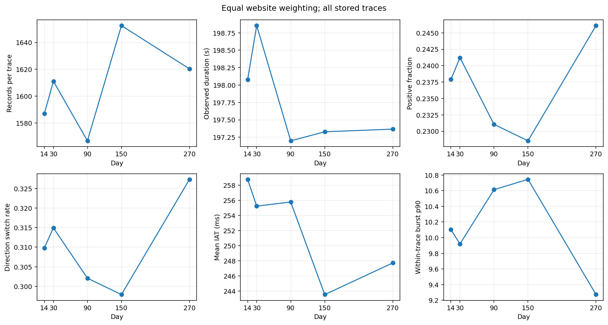
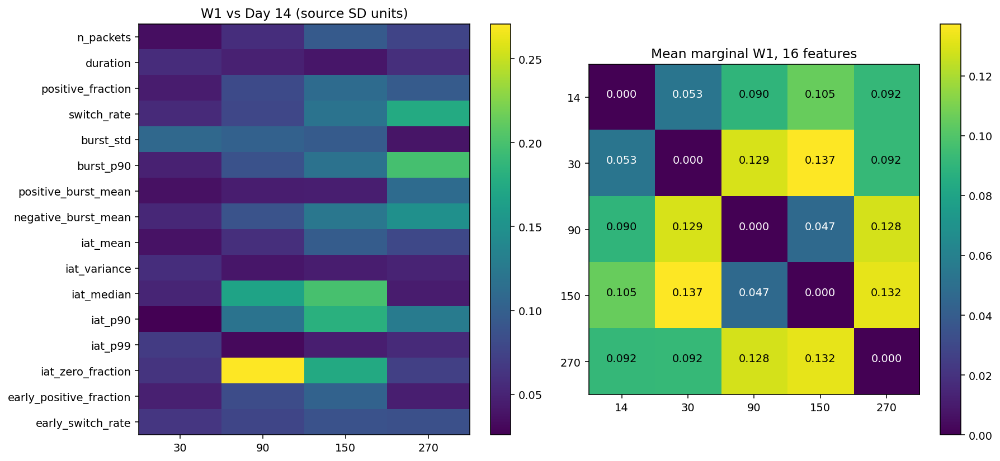
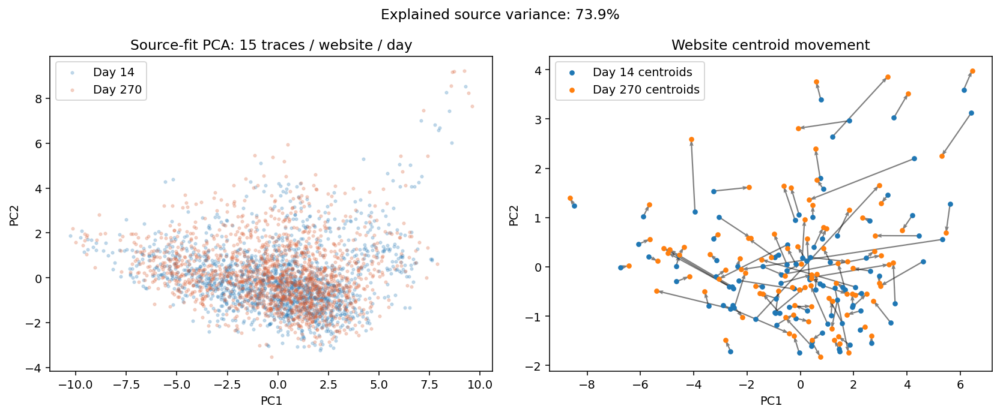
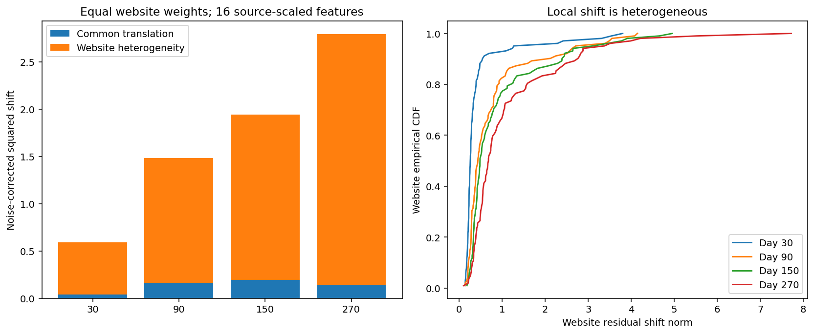
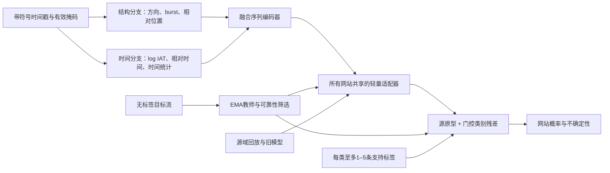

# Tor流量时间漂移深度分析与防御算法设计报告

分析日期：2026-09-10。数据：`/data/diaomingxuan/Traffic-Drift/datasets/TemporalDrift`。源域按本任务定义为 **Day 14**；目标域为 Day 30、90、150、270。

## 摘要（Abstract）

对 118,068 条 Tor 流的实测表明，时间漂移同时包含显著的公共平移与更强的网站间偏移异质性，且总体分布相近仍可伴随分类性能下降，因此建议采用“受约束的共享适配器＋可信度门控的类别原型残差＋源域回放”，在目标域零标签或每类仅 1–5 个标签的约束下进行适应。

## 第一部分：数据层面的漂移演变

### 1.1 数据范围、字段与任务边界

本次实际读取全部五个 `day*.npz`，没有把 `train.npz`、`valid.npz` 或 `tam_*.npz` 当作 Day 14。各文件均包含 `X` 与 `y`：`X` 为 `float64` 的二维矩阵，每条流最多存储 10,000 个记录；`y` 虽存为浮点数，但检查后均为整数类别编号 0–101，五天类别集合完全相同。未发现 NaN/Inf、有效序列内部零填充，或日内／跨日完全相同的原始流。

| 日期 | 流数量 | 网站数 | 每类流数范围 | 达到 10,000 记录上限的比例 |
|---|---:|---:|---:|---:|
| Day 14 | 22,603 | 102 | 201–236 | 0.964% |
| Day 30 | 22,867 | 102 | 202–235 | 0.538% |
| Day 90 | 28,599 | 102 | 239–293 | 1.080% |
| Day 150 | 24,064 | 102 | 203–496 | 1.226% |
| Day 270 | 19,935 | 102 | 85–204 | 1.094% |

总计 **118,068 条流、190,710,024 个非零记录**。Day 150 的少数类别被采集了明显更多次，Day 270 类别 9 仅有 85 条。因此主要统计采用“网站等权、网站内流等权”，避免样本比例变化冒充流量形态变化；这并不意味着实际部署中的网站访问先验均匀。

**字段语义是本次分析的关键：** 仓库历史版本的 `data_processor.py` 使用 `sign(X)` 得到方向、`abs(X)` 得到时间，并对绝对时间做差构造 IAT。故有效记录记作

\[
x_j=s_jt_j,\qquad s_j\in\{-1,+1\},\quad t_j=|x_j|.
\]

零表示尾部填充。时间单位按原处理代码的秒制约定解释；NPZ 自身没有单位元数据。数据没有提供可靠的正负方向物理映射，因此报告统一称“正方向／负方向”，不擅自解释为上传／下载。

**真实 Packet Length（字节包长）不可观测。** 本报告中的记录数、方向游程长度都不是字节包长，不能从 Tor cell 的固定尺寸反推出链路上的 TCP/IP 包长分布。需要原始 PCAP 或独立包长字段才能完成真正的包长漂移分析。

数据来源仓库的提交为 `4cdab4163bf3de7036a2498dac533c888b97664d`。其配套论文说明 TemporalDrift 采用新加坡云服务器，客户端 Tor 固定为 **0.4.8**，采样日期为 Day 0、14、30、90、150、270。本任务重新以 Day 14 为源域，Day 270 距它 **256 天**，不同于原论文的 Day 0 训练协议，不能直接复用原文性能。也不能把本数据的变化归因于已证实的客户端 Tor 版本升级。[数据原始论文，Appendix A](https://www.ndss-symposium.org/wp-content/uploads/2026-s59-paper.pdf)

本数据标签是网站类别，适合研究 **Tor 网站指纹识别模型的抗漂移能力**；没有 Tor／非 Tor 二分类标签。下文“防御”指防御分类器性能衰退，而非通过填充和延迟注入保护 Tor 用户隐私。

### 1.2 时间戳倒序、截断与测量选择

原始时间戳存在少量倒序：

| 日期 | 倒序 IAT / 全部有效相邻对 | 涉及倒序的流 | 倒序绝对幅度 p99 |
|---|---:|---:|---:|
| Day 14 | 0.1918% | 15,421 | 0.234 ms |
| Day 30 | 0.2149% | 15,700 | 0.218 ms |
| Day 90 | 0.1215% | 17,062 | 0.159 ms |
| Day 150 | 0.1509% | 16,006 | 0.179 ms |
| Day 270 | 0.1688% | 14,364 | 0.300 ms |

这类记录在包级很少，却影响大量流，直接删除整条流会严重改变样本组成。主分析保留存储顺序与方向，采用单调包络：

\[
\widetilde t_j=\max_{k\le j}t_k,\qquad
\operatorname{IAT}_j=\widetilde t_j-\widetilde t_{j-1}.
\]

这是一项明确的测量修正，并非声称重建了真实到达次序。它以最大已观测时间戳作为结束时刻，得到 \(\max_j t_j-t_1\) 的观测跨度；若末记录倒序，这不等于原始首末记录之差。这样可避免逐个负差截零后累计时间被反复抬高。Day 270 最大倒序为 390.8 ms，故也不能将所有倒序都当成可忽略的浮点误差。修正引入的零 IAT 会影响零间隔比例和极短 IAT，报告另外检查完全不含时间特征的分解结果。

每个日期约 92.2%–95.3% 的流具有 190–210 秒的观测跨度，提示采集窗口／结束规则的强烈影响。**约 198 秒的平均跨度不能解释成网站平均加载时间。** 达到 10,000 记录的流存在潜在右截断；主结果描述存储后的观测序列，另做“去掉达到上限的流”和“只看前 1,000 个位置”两种敏感性分析。

### 1.3 统计特征的演变

每条流提取 29 个统计量，包括非零记录数、观测跨度、正方向比例、方向均值／方差、切换率、同方向 burst 游程统计、IAT 均值／方差／分位数、前 500 个记录的方向特征等。方向切换率为

\[
r_{\rm sw}=\frac{\sum_{j=2}^{n}\mathbf1(s_j\ne s_{j-1})}{n-1}.
\]

下表均值先在每个网站内平均，再对 102 个网站等权平均；“±”是该等权流混合分布的标准差，不是均值的置信区间。

| 特征 | Day 14 | Day 30 | Day 90 | Day 150 | Day 270 |
|---|---:|---:|---:|---:|---:|
| 记录数 / 流 | 1,587 ± 1,693 | 1,611 ± 1,623 | 1,567 ± 1,563 | 1,653 ± 1,610 | 1,620 ± 1,637 |
| 观测跨度（s） | 198.08 ± 12.79 | 198.85 ± 9.42 | 197.20 ± 12.46 | 197.33 ± 13.11 | 197.37 ± 12.05 |
| 正方向比例 | 0.2379 ± 0.0852 | 0.2412 ± 0.0871 | 0.2311 ± 0.0859 | 0.2285 ± 0.0851 | 0.2461 ± 0.0858 |
| 方向切换率 | 0.3098 ± 0.1000 | 0.3149 ± 0.1004 | 0.3021 ± 0.1012 | 0.2979 ± 0.0987 | 0.3273 ± 0.1062 |
| 流内平均 IAT（ms） | 258.79 ± 228.30 | 255.24 ± 228.07 | 255.79 ± 231.38 | 243.54 ± 218.58 | 247.73 ± 225.82 |
| 流内 IAT 方差的均值（s²） | 1.0279 | 0.9957 | 1.0542 | 1.0077 | 1.0062 |
| 流内方向方差的均值 | 0.6961 | 0.7018 | 0.6812 | 0.6763 | 0.7127 |
| 流内 burst 长度 p90 的均值 | 10.10 | 9.92 | 10.61 | 10.74 | 9.27 |

这里“流内 IAT 方差的均值”与“流内平均 IAT 在不同流之间的方差”是不同量；完整 CSV 同时保留每个流级特征的跨流方差。统计单位是流，不把同一流中的包当成独立观测。



主要现象是：

1. **均值变化小于类别内部的重排。** Day 14 到 Day 270，平均记录数仅增加约 2.1%，流内平均 IAT 降低约 4.3%；这不代表每个网站都稳定。
2. **方向与 burst 结构出现阶段性变化。** Day 90/150 的正方向比例及切换率较低，Day 270 回升；与此同时 burst p90 降到 9.27。以这些指标观察，晚期流的同方向连续片段趋短、方向交替趋频繁。
3. **不支持“所有网络时延随时间持续变大”。** IAT 和跨度都不呈这样的单调关系；约 200 秒的窗口还会掩盖真实加载过程。

### 1.4 分布偏移：边际距离并不单调累积

分布距离使用预先指定的 16 维核心特征，避免同时放入方向均值、正方向比例等确定性重复坐标。计数／长尾量采用 `log1p`，时间先换成 ms、时间方差换成 ms²；比例维度保留原尺度。随后仅在 Day 14 拟合标准化器，对全部日期使用同一尺度。本节是探索性诊断，使用完整 Day 14；后面的预测实验另行只在源训练子集拟合尺度。

**Wasserstein-1：** 对每个特征计算等网站权重的经验一维分布距离，再报告 16 维距离的平均值：

\[
\overline W_1(t)=\frac1{16}\sum_{j=1}^{16}
W_1\!\left(P_{14}^{(j)},P_t^{(j)}\right).
\]

它是**平均边际 W1**，不是完整 16 维 Wasserstein 距离；其数值单位是相应变换特征的源域标准差。

**MMD：** 使用同一 16 维空间及固定高斯核
\(k(u,v)=\exp[-\gamma\|u-v\|^2]\)，其中 \(\gamma=0.0243055\)，仅由 Day 14 的距离中位数规则确定。每轮从每个网站抽取 10 条流，即每域 1,020 条，重复 10 次。由于固定了每类配额，采用按类别对等权的分层 U 统计量：相同类别内部排除自配对，不套用混合 IID 的统一分母。公式为

\[
\widehat{\mathrm{MMD}}^2=
\frac1{C^2}\sum_{c,d}\widehat{\mathbb E}k(X_c,X'_d)
+\frac1{C^2}\sum_{c,d}\widehat{\mathbb E}k(Y_c,Y'_d)
-\frac2{C^2}\sum_{c,d}\widehat{\mathbb E}k(X_c,Y_d).
\]

其中 \(c=d\) 的同域项使用 \(m(m-1)\) 个有序异样本对，其他项使用 \(m^2\) 对。该估计可略为负，不对负数截零。报告重复抽样标准差作为计算采样波动，**不是总体置信区间或检验 p 值**。[MMD 原始方法](https://www.jmlr.org/papers/v13/gretton12a.html)

| 与 Day 14 比较 | 平均边际 W1 | 分层 MMD²，均值 ± 抽样 SD | Day 14 内部分割 MMD²参考均值 |
|---|---:|---:|---:|
| Day 30 | 0.05330 | 0.001233 ± 0.000424 | 0.000084 |
| Day 90 | 0.08990 | 0.003823 ± 0.000637 | 0.000039 |
| Day 150 | 0.10527 | 0.004232 ± 0.001311 | −0.000008 |
| Day 270 | 0.09165 | 0.003732 ± 0.000529 | 0.000061 |

源域参考在每次抽样中使用两个互不重叠的分层子集。其接近零，跨日值较大；正式显著性论证放在下一节的均值差检验，不把这 10 次抽样当成 10 次独立采集。



Day 270 比 Day 150 的总体边际距离更小；Day 90 与 Day 150 的平均 W1 仅 **0.04710**，而 Day 150 到 Day 270 为 **0.13217**。因此“五个节点上的漂移”具有阶段性和回摆，不能写成连续时间上的单调定律。

Day 270 偏移最大的几个边际特征是 burst p90（0.1987）、方向切换率（0.1753）、负方向 burst 均值（0.1490）和 IAT p90（0.1276）。这些数值描述变换后的源域标准差尺度，不能当成原始单位的变化百分比。

### 1.5 特征空间可视化

PCA 仅在 Day 14 的完整核心特征上拟合。前两主成分分别解释 60.76%、13.19% 的源域方差，合计 **73.95%**。每个日期每个网站抽 15 条流作散点；右图连接各网站 Day 14 与 Day 270 的完整样本中心。



两天总体点云明显重叠，但部分网站中心跨越较远，箭头方向和长度不一致。另用每天每网站 50 条流构造等类别诊断集，日期二分类 ExtraTrees 在 30% 保留集上的 AUC 为 **0.7568**。这说明本特征集包含可辨别日期的信息；它不是网站分类准确率，也不能消除未知会话相关性。低维重叠本身不证明没有漂移，中心箭头也不构成漂移原因的证明。

## 第二部分：全局与局部漂移假说验证

### 2.1 将直觉改写成可检验命题

设标准化流特征为 \(z\in\mathbb R^{16}\)，网站 \(c\) 在日期 \(t\) 的均值为 \(\mu_{c,t}\)。定义

\[
\Delta_{c,t}=\mu_{c,t}-\mu_{c,14},\quad
g_t=\frac1C\sum_c\Delta_{c,t},\quad
\ell_{c,t}=\Delta_{c,t}-g_t,\quad C=102.
\]

\(g_t\) 是**公共平移成分**，\(\ell_{c,t}\) 是**网站间偏移异质性**，且 \(\sum_c\ell_{c,t}=0\)。有恒等式

\[
E_{\mathrm{total},t}=\frac1C\sum_c\|\Delta_{c,t}\|^2
=\underbrace{\|g_t\|^2}_{E_G}
+\underbrace{\frac1C\sum_c\|\ell_{c,t}\|^2}_{E_L}.
\]

**任何数据都能如此分解，分解存在本身不能验证假说。** 因此分别检验：

\[
H_{0,G}:g_t=0;\qquad
H_{0,L}:\Delta_{1,t}=\cdots=\Delta_{C,t}.
\]

后者询问“是否存在超出相同公共平移的类别差异”，不是“各天分布是否完全相同”。

### 2.2 估计噪声校正与显著性

每个网站均值的估计协方差为

\[
V_{c,t}=\frac{S_{c,t}}{n_{c,t}}+\frac{S_{c,14}}{n_{c,14}}.
\]

有限样本会把均值漂移能量抬高。校正项为

\[
N_T=\frac1C\sum_c\operatorname{tr}(V_{c,t}),\quad
N_G=\frac1{C^2}\sum_c\operatorname{tr}(V_{c,t}),\quad N_L=N_T-N_G.
\]

报告 \(\widehat E_T-N_T\)、\(\widehat E_G-N_G\)、\(\widehat E_L-N_L\)，不将负估计强制截为零。所有协方差保留网站×日期的异方差。

实现采用 **1,999 次高斯乘子均值 bootstrap**：对每个网站独立抽取 \(\epsilon_c\sim N(0,V_c)\)，以 \(\|\bar\epsilon\|^2\) 校准公共平移零假设，以 \(C^{-1}\sum_c\|\epsilon_c-\bar\epsilon\|^2\) 校准共同平移下的异质性零假设。这等价于对中心化样本施加正态乘子的均值近似，并非假定原始 IAT 本身正态；仍依赖网站内均值的近似及流之间独立性。

四个日期×两种整体检验共 8 个 p 值使用 Holm 校正。另对 408 个“网站×日期”的局部残差范数检验统一做 BH-FDR，作为定位具体网站的探索性结果。所给能量区间是固定估计协方差下的近似 95% 乘子区间，没有纳入协方差估计和标准化器的不确定性。

| 日期 | 校正总能量 | 公共能量 | 异质性能量 | 公共占比，近似 95% CI | 两类整体检验 Holm p | 局部残差 BH q<0.05 的网站数 |
|---|---:|---:|---:|---:|---:|---:|
| Day 30 | 0.5909 | 0.0400 | 0.5509 | 6.77% [5.28%, 8.44%] | 0.004 / 0.004 | 25 / 102 |
| Day 90 | 1.4805 | 0.1627 | 1.3177 | 10.99% [9.77%, 12.29%] | 0.004 / 0.004 | 66 / 102 |
| Day 150 | 1.9420 | 0.1957 | 1.7463 | 10.08% [9.05%, 11.22%] | 0.004 / 0.004 | 78 / 102 |
| Day 270 | 2.7930 | 0.1424 | 2.6506 | 5.10% [4.60%, 5.64%] | 0.004 / 0.004 | 85 / 102 |

每个原始整体检验均达到本次 Monte Carlo 分辨率下限 0.0005；Holm 后为 0.004，不能写成“p=0”。Day 270 公共能量区间为 [0.1295, 0.1567]，异质性能量区间为 [2.5315, 2.7767]，均明显高于各自估计噪声。



**结论：在这 16 维表示、102 个已观测网站、流独立的推断条件下，公共平移和网站偏移异质性均有统计支持，且后者占主导。** 校正总能量在已观测节点由 0.591 增至 2.793，但公共占比不单调；“5.1% / 94.9%”是这套特征度量的描述，不是网络因素／网站内容因素的真实因果贡献比例。

### 2.3 为什么总体均值稳定仍然会损伤分类器

Day 270 有 86/102 个网站的偏移在 \(g_t\) 方向上的投影为正，但各网站的幅度仍相差很大，且有相反移动。以下数字是每个网站所有流的原始特征均值：

| 类别 ID | 记录数 Day14 → Day270 | 正方向比例 | 方向切换率 | 平均 IAT（ms） |
|---|---:|---:|---:|---:|
| 39 | 4,448.7 → 640.0 | 0.0925 → 0.2844 | 0.1538 → 0.4098 | 47.62 → 322.44 |
| 94 | 479.2 → 4,054.1 | 0.2596 → 0.1833 | 0.3286 → 0.2460 | 422.43 → 58.35 |
| 92 | 6,218.0 → 2,132.2 | 0.1475 → 0.2599 | 0.2055 → 0.3334 | 34.73 → 102.13 |
| 9 | 1,285.8 → 3,080.9 | 0.2451 → 0.1557 | 0.3407 → 0.2268 | 405.68 → 148.95 |

类别 39 和 94 近乎相反的体量变化可以在总体混合分布中抵消；网站身份与特征位置的对应关系却会变化。NPZ 没有网站 ID 到真实域名的映射，因此不能把这些编号对应到具体网站，也不能判断是否由页面更新、抓取失败或采集条件差异造成。

几何检查同样不支持“一切都因为类内方差越来越大”：类内散度 \(W\) 为 5.776、5.857、5.294、5.782、5.926，类间散度 \(B\) 为 10.206、9.854、10.529、10.064、10.277，\(B/W\) 为 1.767、1.682、1.989、1.741、1.734。它们没有持续坍缩。解释漂移需要关注**类别中心与决策边界的相对位置**，不能只看混合方差。

### 2.4 稳健性、替代解释与概念边界

**测量敏感性。** Day 270 公共占比在仅用方向／记录数／burst 的 9 维特征时为 7.30%，仅时间特征时为 1.91%，去掉达到 10,000 记录上限的流后为 5.43%，只看前 1,000 个位置时为 6.22%。这些是不同表示下重新估计的效果量；支持“公共平移不是主要解释”的定性结论，也表明精确占比依赖表示。前缀分析包含不足 1,000 记录的短流，并不意味着每条流都有恰好 1,000 个包。

**公共变换不一定是平移。** 假如存在共享仿射变化

\[
\mu_{c,t}=A_t\mu_{c,14}+b_t,
\]

则 \(\Delta_{c,t}=(A_t-I)\mu_{c,14}+b_t\) 本来就会随网站而异。所以 \(\ell_c\ne0\) 不能直接证明网站内容变化。额外用五折“留出网站”评估共享映射，在训练网站上拟合、预测未参与拟合的网站均值：

| Day 270 的共享映射 | 留出网站均值预测的平均平方误差 |
|---|---:|
| 不校正 | 2.8505 |
| 共享平移 | 2.7480 |
| 共享对角仿射 | 2.6106 |
| 共享完整 Ridge 仿射 | 2.6064 |

对角与完整映射均用预定 Ridge 正则 10，拟合相对恒等映射的残差。更灵活的共享映射只将误差减少约 8.6%，仍留下较大残差，但这不是对所有可能非线性网络变换的穷尽排除。该实验使用目标类别均值做**离线诊断**，不是允许部署使用完整目标标签的适应方法。

Day 270 偏移矩阵第一奇异方向占原始平方能量约 73.6%，说明多个类别变化可能沿共同低维方向发生；高异质性并不等于每个网站完全独立、毫无共享结构。神经网络中是否也有相同低秩结构，还需重新检验。

**严格区分统计概念：** \(p_t(x\mid y)\) 的变化是类条件分布漂移；严格 covariate shift 还要求 \(p_t(y\mid x)=p_s(y\mid x)\)。本次均值分析没有单独验证这一条件，也没有严格识别后验概念漂移或具体因果来源。最稳妥的结论是“可观测公共偏移＋显著类别异质性”，不是“已经证明网络升级＋网站内容更新”。

数据缺少电路、会话、抓取批次、浏览器状态等分组元数据，完全重复排查不能排除相关流；若流不独立，置信区间和 p 值可能过于乐观。仅五个日期也不足以区分季节性、采集批次效应和连续时间机制。下一阶段应收集这些元数据并做按会话／日期块的推断。

## 第三部分：抗漂移算法设计（重点）

### 3.1 先用受限标签实验验证设计方向

本次除诊断外，实际运行了轻量基线，明确限制模型获得的目标标签。输入是上述 16 维统计特征，**不是已训练的深度序列编码器**。

- Day 14 分层 70% 训练、30% 测试：15,822 / 6,781 条。全部超参数预先固定，没有用该源测试子集调参。
- 每个目标日期先不看标签随机分成 50% 适应集、50% 测试集，所有方法共用同一切分。目标测试特征也不参与均值、协方差或原型拟合。
- UDA 仅使用适应集特征。Few-shot 从适应集中模拟每个已知网站的 1 或 5 次有标签采集，合计 **102 / 510 个目标标签**；其余目标标签仅在最后计算指标时使用。
- 分别使用随机种子 11、29、47；不同日期独立从 Day 14 适应，没有使用中间日期或未来日期。
- 少样本支持集的类别配额由基准采样器模拟，表示主动采集已知网站的访问；不表示可以免费从匿名流量中发现真实类别。

ExtraTrees 使用 250 棵树。原型分类器采用源域池化类内协方差的收缩 Mahalanobis 距离。均值对齐为 \(z'_t=z_t-\bar z_U+\bar z_S\)；CORAL 在此基础上匹配收缩协方差。Few-shot 原型以预定 \(\kappa=5\) 收缩：

\[
p^{(k)}_{c,t}=\frac{5p^S_c+k\bar z^{K}_{c,t}}{5+k}.
\]

下表为 **balanced accuracy，即宏平均类别召回率**，单位为百分比；± 是三个种子之间的标准差，不是独立采集重复的置信区间。

| 方法 | Day 14 | Day 30 | Day 90 | Day 150 | Day 270 |
|---|---:|---:|---:|---:|---:|
| Source ExtraTrees | 35.43 ± 0.56 | 30.21 ± 0.19 | 26.21 ± 0.16 | 22.47 ± 0.24 | 21.25 ± 0.34 |
| 均值 UDA + ExtraTrees | — | 30.41 ± 0.19 | 26.52 ± 0.37 | 22.61 ± 0.09 | 20.51 ± 0.23 |
| CORAL UDA + ExtraTrees | — | 30.34 ± 0.16 | 26.42 ± 0.41 | 22.38 ± 0.23 | 20.30 ± 0.30 |
| Source 原型 | 29.74 ± 0.24 | 26.54 ± 0.35 | 24.18 ± 0.24 | 20.45 ± 0.21 | 19.85 ± 0.37 |
| 均值 UDA + 原型 | — | 26.78 ± 0.19 | 24.59 ± 0.08 | 21.13 ± 0.26 | 20.26 ± 0.23 |
| CORAL UDA + 原型 | — | 26.91 ± 0.28 | 24.68 ± 0.12 | 20.96 ± 0.32 | 20.31 ± 0.24 |
| 均值 UDA + 1-shot 原型 | — | 25.06 ± 0.18 | 24.25 ± 0.09 | 20.97 ± 0.59 | 20.58 ± 0.36 |
| 均值 UDA + 5-shot 原型 | — | 24.27 ± 0.56 | 24.72 ± 0.20 | 21.87 ± 0.29 | 23.14 ± 1.07 |

Day 270 的普通 accuracy / macro-F1 分别为：Source ExtraTrees **21.45% / 19.56%**，均值 UDA 原型 **20.39% / 18.18%**，均值 UDA + 5-shot 原型 **23.20% / 20.89%**。完整各日三种指标保存在结果 CSV 中。

这些实验揭示两点：**统一对齐收益有限并可产生负迁移**；少量类别信息在较晚日期有帮助，但 Day 30 的 5-shot 原型反而从 26.78% 降至 24.27%。因此不应对所有网站做相同强度更新。低维原型的容量和噪声也限制了结果，不能把这些数值当作完整深度算法的上限或已验证效果。

### 3.2 推荐架构：共享校准、类别残差、冻结主体

建议将第一版深度模型设计为两个输入分支、一个共享适配器和一个带收缩的目标原型头：



**结构分支**使用方向序列、同方向游程及相对包位置，可用紧凑多尺度 1D CNN；**时间分支**使用 \(\log(1+\mathrm{IAT}/1\mathrm{ms})\)、归一化相对时间及少量原始尺度时间统计。归一化时间增强抗环境变化能力，保留原尺度通道以免删除网站可判别信息。尾部 padding 使用掩码，不参与池化或 IAT 计算。可先固定输入前缀长度 \(L=1,000\)，之后在源域验证集中比较 500／1,000／5,000；本报告未确定最优长度。

融合编码器输出 \(h_\theta(x)\in\mathbb R^d\)，例如 \(d=128\)。Source training 后首先冻结主体，仅更新小型目标适配器和类别原型；必要时解冻最后一个块，且训练轮数、学习率通过源域模拟漂移预先确定。

共享适配器可采用受约束的逐维仿射或 FiLM：

\[
z_t=G_{\phi_t}(h_\theta(x)),\quad
G_{\phi_t}(h)=a_t\odot h+b_t,
\]

其中 \(a_t\) 限制在源域模拟实验预定的正值区间，\(b_t\) 强正则。所有类别共享参数，不能输入真实目标类别。源域分支保留恒等适配器及原始原型，作为稳定参考和回退路径；若解冻共享编码器，源域回放约束会直接约束共享参数。

目标原型为

\[
p_{c,t}=p_c^S+Uv_{c,t},\quad
U\in\mathbb R^{d\times r},\quad r\ll d,
\]

\[
P_t(c\mid x)=
\frac{\exp[-\|z_t-p_{c,t}\|^2/\tau]}
{\sum_{j=1}^C\exp[-\|z_t-p_{j,t}\|^2/\tau]}.
\]

第一版也可直接使用强正则的全维残差；低秩 \(U\) 应通过源域模拟漂移训练，而不能用完整目标类别均值做 SVD 后宣称 UDA。采用 \(\sum_c v_{c,t}=0\) 固定共享平移与类别残差之间的一部分参数歧义。该约束不提供网络因素与网站因素的因果可识别性。[原型分类的基础方法](https://proceedings.neurips.cc/paper/2017/hash/cb8da6767461f2812ae4290eac7cbc42-Abstract.html)

### 3.3 源域训练目标

仅使用 Day 14 训练／验证数据：

\[
\mathcal L_S=
\mathcal L_{\rm CE}
+\lambda_{\rm con}\mathcal L_{\rm SupCon}
+\lambda_{\rm aug}\operatorname{JS}
\big(P_S(\cdot\mid a_1x),P_S(\cdot\mid a_2x)\big).
\]

交叉熵建立网站判别能力；监督对比损失使同类特征更紧凑；增强一致性降低对有限时间缩放、轻度 IAT 扰动和前缀变化的敏感性。增强范围必须在源域确定，不能任意增删大 burst 或反转方向，因为这些可能改变网站身份信息。

源验证集用于温度校准、置信度阈值、原型半径、模型容量与固定适应轮数选择。训练结束保存源编码器、源原型、每类协方差／距离分位数和少量有标签源回放样本。原型与协方差只由源训练集产生。

### 3.4 目标适应损失：避免把所有类别强拉回源域

设 \(U_t\) 为无标签适应集，\(K_t\) 为可选少样本支持集，\(\bar\theta\) 为 EMA 教师。总体目标为

\[
\mathcal L_T=
\lambda_s\mathcal L_{\rm replay}
+\lambda_g\mathcal L_{\rm global}
+\lambda_c\mathcal L_{\rm class}
+\lambda_u\mathcal L_{\rm pseudo}
+\lambda_k\mathcal L_{\rm few}
+\lambda_r\mathcal R
+\lambda_m\mathcal L_{\rm memory}.
\]

**（1）受约束的公共校准。** 早期只在时间校准投影 \(\psi\) 上做小权重 MMD：

\[
\mathcal L_{\rm global}
=\operatorname{MMD}^2
\big(\psi(h_S),\psi(G_{\phi_t}(h_U))\big).
\]

此处源侧参考固定；初始阶段固定类别残差，只更新共享适配器。不能把整个位于不同类别的判别空间无条件强行混合。类别先验未知或可靠锚点不足时降低该项权重；有可信类别锚点后，可改用按可靠类别等权的公共质心偏移校准。源低误差与域不可区分并不足以保证目标分类成功，特别是在类条件分布和类别先验变化时。[域对齐局限的理论分析](https://proceedings.mlr.press/v97/zhao19a.html)

**（2）类别锚点追踪，而非所有类回到旧中心。** 对通过可靠性筛选的网站集合 \(\mathcal C_t^{\rm valid}\)，使用

\[
\mathcal L_{\rm class}=
\frac1{|\mathcal C_t^{\rm valid}|}
\sum_{c\in\mathcal C_t^{\rm valid}}
\|\widehat\mu^{\rm reliable}_{c,t}-(p_c^S+Uv_{c,t})\|^2.
\]

锚点来自允许使用的少量标签或教师伪标签；没有可信样本的类别跳过，保留源原型。锚点由上一轮教师计算并停止梯度，避免原型与锚点在同一更新中相互追逐。真实目标类别不能从诊断 CSV 传进训练 loader。

**（3）伪标签的一致性与门控。**

\[
q_i=\operatorname{stopgrad}P_{\bar\theta}(\cdot\mid a_wx_i),\quad
\widehat y_i=\arg\max_c q_{ic},
\]

\[
m_i=\mathbf1\left[
\max_cq_{ic}\ge\eta_c,\ 
\widehat y_i^{(a_1)}=\widehat y_i^{(a_2)},\ 
\|z_i-p_{\widehat y_i,t}\|\le R_{\widehat y_i}
\right],
\]

\[
\mathcal L_{\rm pseudo}=
-\frac{\sum_i m_i\log P_t(\widehat y_i\mid a_sx_i)}{\max(1,\sum_i m_i)}.
\]

教师 EMA 更新为 \(\bar\theta\leftarrow\rho\bar\theta+(1-\rho)\theta\)。阈值 \(\eta_c\)、半径 \(R_c\) 与 \(\rho\) 在源域校准和模拟漂移中预定。高置信错误仍可能被接受，尤其是网站特征移动到其他网站区域时；不能把低熵直接当成高正确率。采用类内接受上限、更新幅度限制和小步数，但不强行将真实未知的目标先验设成均匀。[置信度与增强一致性的基础方法](https://proceedings.neurips.cc/paper/2020/hash/06964dce9addb1c5cb5d6e3d9838f733-Abstract.html)

**（4）Few-shot 锚定与样本量自适应收缩。**

\[
\mathcal L_{\rm few}=-\frac1{|K_t|}\sum_{(x,y)\in K_t}\log P_t(y\mid x),
\]

\[
\mathcal R=\|\phi_t-\phi_{\rm init}\|^2+
\sum_c\frac{\kappa}{k_c+\alpha\min(n_c^{\rm eff},n_{\max})+\epsilon}
\|v_{c,t}\|^2.
\]

其中 \(k_c\in\{0,1,\ldots,5\}\) 为实际支持标签数，\(n_c^{\rm eff}=(\sum_iw_{ic})^2/\sum_iw_{ic}^2\) 是可靠伪标签的有效样本数，\(\alpha<1\) 降低伪标签相对真实标签的权重。适配器先校准，随后固定或放缓其更新，再更新类别残差，降低两个模块互相补偿的风险。

类级门控应同时考虑锚点不确定性与漂移幅度：若估计偏移小于均值估计噪声、只得到不一致伪标签，或支持集极少且偏移方向不稳定，则保持 \(v_c=0\) 或使用强收缩。**不能根据目标测试集上哪个类掉分来决定门控。** Day 30 少样本负迁移正说明这项限制有现实必要。

**（5）源域回放与持续记忆。** 当共享编码器可训练时，用源域有标签样本保持源网站判别边界；在完全冻结编码器的第一版中，源分支损失是诊断约束，真正限制目标头的是上述参数／原型收缩。对于旧目标记忆和上一版本目标模型，使用

\[
\mathcal L_{\rm memory}=
T^2\mathbb E_{x\in M}
\operatorname{KL}\big(P_{\rm old}^{(T)}(\cdot\mid x)\|P_t^{(T)}(\cdot\mid x)\big)
+\gamma\|\phi_t-\phi_{t-1}\|^2.
\]

旧目标记忆保存特征与冻结预测，预测不是目标真标签。持续适应保留源检查点、历史适配器及原型快照，以便回滚。该思路与持续测试时适应相关，但本报告没有运行 CoTTA 或完整深度持续实验。[持续适应原始研究](https://openaccess.thecvf.com/content/CVPR2022/html/Wang_Continual_Test-Time_Domain_Adaptation_CVPR_2022_paper.html)

### 3.5 具体训练与适应流程

1. **Source training。** 在 Day 14 内划分训练、验证、最终源测试，训练双分支编码器与源分类头；只使用训练／验证确定所有超参数。通过源数据模拟时间尺度和局部结构扰动，预设适应步数、损失权重、门控与回退阈值。
2. **目标隔离。** 在查看目标表现前固定适应集 \(U_t\)、支持集 \(K_t\) 和封存测试集 \(E_t\)。UDA 的 batch 只返回特征，不返回标签；Few-shot 只从独立支持 loader 读取至多 \(k\) 个标签／类。
3. **共享热身。** 从源模型或上一合法时间点检查点开始，冻结主体与类别残差，用 \(U_t\) 进行有限步共享校准。保留校准前模型，记录源保留集表现与参数偏移。
4. **建立可信锚点。** EMA 教师生成伪标签，按置信度、增强一致性和原型距离筛选。若存在 \(K_t\)，以其作为更高权重类别锚点。某类无可信锚点时不更新该类。
5. **交替适应。** 少量更新共享适配器，随后更新可信类别原型；目标 \(\mathcal L_T\) 中 UDA 设置 \(\lambda_k=0\)，Few-shot 才启用支持交叉熵。保持源回放／记忆和限制更新幅度。
6. **停止与评估。** 使用源域预定轮数或无标签稳定性规则停止，不选择“目标测试分数最高的 checkpoint”。无标签稳定性只是一种停止启发，不保证目标准确率改善。最后一次性解封测试标签评分。
7. **持续模式。** 按 \(14\to30\to90\to150\to270\) 顺序处理；在线严格先预测当前流，再用其无标签信息更新，禁止读取未来时间点。定期报告历史域遗忘和当前域收益。

损失权重不能由本次全部目标标签反复搜索。建议先在源域模拟实验比较“仅共享”“仅类别残差”“两者结合”，再固定权重和有限超参数候选；本报告不提供未经训练验证的“最佳参数”。

### 3.6 标签预算、可识别性与下一步确认实验

| 范式 | 目标训练标签 | 单个目标日期，102 类 | 四个目标日期的累计成本 |
|---|---|---:|---:|
| UDA | 无 | 0 | 0 |
| 每期 1-shot | 每类 1 个 | 102 | 408 |
| 每期 5-shot | 每类 5 个 | 510 | 2,040 |
| 全周期总计 5-shot | 全周期每类合计≤5 | 按期分配 | 最多 510 |

“每期 5-shot”不能写成“全周期只需 5-shot”。支持标签预算已经包含可使用的全部目标标签，不另外创建有标签目标验证集。若有目标测试特征参与无标签适应，必须单列为 transductive 设定；本次基线采用适应／测试特征隔离的设定。

纯 UDA 在任意类条件漂移下不存在一般保证：若两个网站的特征分布发生交换，仅看无标签混合分布可能无法恢复其身份。这是少量真实类别锚点有价值的原因，也是必须保留拒绝更新或回退机制的原因；不是所有漂移都能靠 MMD 或伪标签自动消除。

本报告已经使用所有目标日期标签完成探索性诊断，架构动机也参考了该诊断；即使训练 loader 无标签泄漏，未来仍需用**新日期或独立采集批次**做确认性评估，避免研究者反复适配同一测试集。

下一步建议在相同输入、切分和标签预算下，比较 Source-only、共享适配、局部残差、完整 UDA、完整 1／3／5-shot、去掉门控与回放的消融，以及既有 Proteus。Proteus 已提出无标签流量适应，不能把“使用 MMD＋伪标签”本身当成新贡献；本方案待验证的重点是共享校准与有收缩的类别残差如何协同、何时拒绝局部更新。[Proteus 官方论文页面](https://www.ndss-symposium.org/ndss-paper/enhancing-website-fingerprinting-attacks-against-traffic-drift/)

至少报告 macro-F1、accuracy、balanced accuracy、逐类召回、最差 10% 类别、伪标签接受率与错误率、实际标签成本、历史域遗忘、适应耗时和峰值显存。新实验建议不少于 5 个支持采样种子；本次轻量初步实验只有 3 个。真实部署通常还有未知网站，应另加开放集拒识评估，当前 102 类闭集结果不能证明开放集可用。

## 第四部分：对未来落地的思考

### 4.1 计算复杂度与资源预算

设流前缀长度为 \(L\)，批量为 \(B\)，嵌入维度为 \(d\)，类别数 \(C=102\)，低秩维度为 \(r\)。

| 组件 | 主要开销 | 部署考虑 |
|---|---|---|
| 方向／IAT／burst 特征 | 扫描 \(O(L)\)；精确分位数另有选择／排序开销 | 在线用流式均值／方差与分位数草图 |
| 固定宽度 1D CNN | 约随 \(L\) 线性增长 | 必须另外报告等到前缀到齐的采集延迟 |
| 逐维共享适配器 | \(O(d)\) | 可在 CPU 执行 |
| 类别原型打分 | \(O(Cd)\) | 批量矩阵运算；原型可预计算 |
| 低秩残差参数 | \(O(dr+Cr)\) 存储 | 无需给每个网站训练独立大型网络 |
| 精确批量 MMD | \(O(B^2d)\) 时间、\(O(B^2)\) 核矩阵 | 用小批量、线性估计或随机 Fourier 特征 |
| 特征记忆缓冲 | \(O(Md)\) | 主体冻结时可缓存嵌入；主体更新后需重算或保留原流 |

例如 \(d=128,r=8\)，\(U\) 和全部 \(v_c\) 共 1,840 个数，FP32 约 7.2 KiB；源原型 13,056 个数，约 51 KiB。它们不包括编码器、教师副本、协方差、训练状态和缓冲。MMD 若用 \(D\) 维随机 Fourier 特征，单批特征计算约 \(O(BdD)\)，随后均值对齐为 \(O(BD)\)。

本次原始文件扫描由五个进程逐块读取，未将所有原始矩阵同时复制到内存；结果与图表保存在独立分析目录。CPU 轻量基线三种子完整运行约 **37.5 秒**，不含原始特征提取。这不能当作深度模型的训练或部署延迟。

### 4.2 在线适应的可行形态

推理路径只保留编码器、共享适配器和原型头，适应放在后台按窗口执行。前台模型固定一个版本，后台仅在通过预定源域保留性能、参数偏移及无标签稳定性检查后切换；这些检查降低不稳定更新风险，但无法无标签证明目标分类正确。

按窗口监控时间特征分布、原型距离、接受样本比例和类别覆盖，超过源模拟阈值才触发有限步适应。对不可信类别保持旧原型；对极端分布外流做拒识或延迟决策。不能仅凭目标熵下降就上线新模型。

完整流的观测窗口约 200 秒，本身不适合低延迟判别；前缀模型必须同时报告从连接开始到采集足够记录的 p50/p95 延迟、模型推理延迟和前缀截断带来的准确率损失。当前数据缺少真实在线吞吐与设备测量，尚不能承诺实时性能。

### 4.3 已完成交付与复现

本次完成了全量字段审计、29 维流级特征提取、16 维分布距离、PCA、均值漂移的噪声校正／显著性检验、仿射与截断敏感性分析，以及严格目标标签预算的经典基线。**双分支深度适应框架是本报告提出的设计，尚未训练验证。**

| 文件 | 内容 |
|---|---|
| [extract_features.py](extract_features.py) | 原始 NPZ 逐块读取、倒序／截断审计、流哈希、全长与前缀特征 |
| [analyze.py](analyze.py) | 距离、PCA、噪声校正分解、统计检验、敏感性分析与四幅图 |
| [baselines.py](baselines.py) | Source-only、均值／CORAL UDA、每类 1／5-shot 原型实验 |
| [verify_analysis.py](verify_analysis.py) | 特征不变量、分层 MMD 独立计算、能量恒等式及支持／测试隔离检查 |
| [manifest.json](results/manifest.json) | 数据形状、各类数量、原始 X 内容哈希、环境版本 |
| [feature_summary.csv](results/feature_summary.csv) | 所有 29 个流级特征的均值、方差和标准差 |
| [decomposition.json](results/decomposition.json) | 全部效果量、区间、整体检验 p 值 |
| [class_drift.csv](results/class_drift.csv) | 网站×日期的偏移大小及 FDR 结果 |
| [baselines_summary.csv](results/baselines_summary.csv) | 各日期各方法三种指标及种子标准差 |
| [baselines_protocol.json](results/baselines_protocol.json) | 固定参数、标签预算与切分信息 |
| [baselines_predictions_and_splits.npz](results/baselines_predictions_and_splits.npz) | 预测、适应／测试／支持集原始行号 |

复现环境：Python 3.8.20、NumPy 1.24.4、SciPy 1.10.1、pandas 2.0.3、scikit-learn 1.3.2、Matplotlib 3.7.5。使用以下顺序运行：

```bash
cd /data/diaomingxuan/Traffic-Drift
TOR_PYTHON=/data/diaomingxuan/anaconda3/envs/WF/bin/python
"$TOR_PYTHON" analysis/temporal_drift/extract_features.py
OPENBLAS_NUM_THREADS=4 OMP_NUM_THREADS=4 "$TOR_PYTHON" analysis/temporal_drift/analyze.py
"$TOR_PYTHON" analysis/temporal_drift/baselines.py
"$TOR_PYTHON" analysis/temporal_drift/verify_analysis.py
```

统计分析随机种子为 20260910；基线种子及完整参数写在协议 JSON。验证脚本已通过：有效记录／IAT 不变量、分层 MMD 的独立类别配对计算、公共平移合成样本、能量恒等式、全量行数、12 组目标切分、每类支持标签预算及报告内部链接；四幅图已进行视觉检查。原始数据没有被修改，仓库原有文件的删除状态也未被恢复或覆盖。
